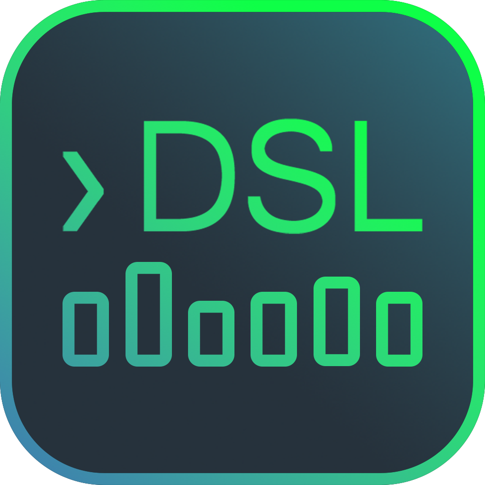
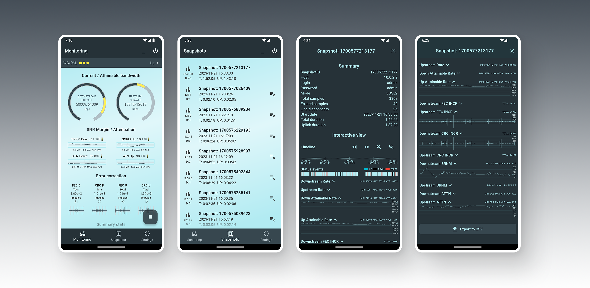

  

<h1 align="center">
  xDSL Monitoring tool
</h1>
<h6 align="center">
  Portable G.DMT/ADSL/VDSL network monitoring software
</h6>

  

### About
**xDSL Monitoring tool** is an mobile app for realtime and background monitoring of G.DMT/ADSL/VDSL networks. It is designed to work with most popular Broadcom and Trendchip network units that support telnet or http interface. Data is displayed in detailed graphical form and can be used to perform line analysis on the go, or as standalone tool for ISPs to perform monitoring on client-end.

### Features
  - Fast and modern UI
  - Wide range of supported network devices
  - Real-time stats monitoring on the go
  - Background monitoring with foreground service
  - Direct TCP connection without OS shell underlying
  - Interactive histograms for detailed analysis
  - Exporting collected data-sets to csv

### Platform
  - Android 4.4+

### Supported network units
  - `Broadcom 63xx based devices through telnet`
    - adsl, xdslcmd, xdslctl, etc command interface support
    - second stage login ('sh' to busybox) support
    - full list of broadcomm devices [here](https://wiki.kitz.co.uk/index.php?title=BCM_routers)
  - `Trendchip (aka Ralink/Mediatek) based devices through telnet`
    - parsing using 'wan adsl diag + status' (less performant)
    - parsing using separate commands (more performant)
    - full list of trendchip devices [here](http://en.techinfodepot.shoutwiki.com/wiki/TrendChip)
  - `HG532e (telnet lock) through http`
    - parsing using http mimicking browser requests
    - stats adress 'html/status/dslinfo.asp'
    - login adress 'index/login.cgi'

> If you want to add new device support you can simply send me a dump of your device's terminal session. It is important to have example commands and responses for successful and unsuccessful attempts to log in, request data, and respond to data in several different states such as idle, connected, initializing, etc.

### Installation
1. [Download](https://github.com/digiboridev/xDSL-Monitoring-tool/releases/) last version.
2. Install apk file.
3. Go to "Settings" screen and configure network unit type, ip, login and password
4. You're ready to press 'Play' button to start monitoring.

### Use-cases
- On Monitoring screen you can see real-time stats optimized for using on the go and performing outdoor line diagnostic with only the phone. No more laptops needed, not big batteries or cars, nor "DSLAM-end" person or ISPs support.
- On Snapshots screen, you can see all the data collected during monitoring sessions, called "Snapshots". You can view it in detailed graphical form using pan and zoom gestures, or export it to a csv file and use it for further analysis at any time.
- Supports background mode so you can leave the phone on the client side for a while (a day, a week, forever) and then analyze the captured data. Really useful in cases where "DSLAM-end" analysis is less informative, such as training attempts, power issues, ISPs tools weak sampling interval and pessimistic sync. 
- To use background logging:
   - Disable battery optimization for app ( build in andoid mechanism to suspend apps activity when screen is off, known as Doze mode )
   - Allow foreground notifications ( build in andoid mechanism to keem app in memory even if app in background )

### Roadmap
  - SNR per tone, Bit table support
  - HLog, QLN support
  - Cloud sync for remote data sharing
  - Multi-device monitoring
  - IOS/Desktop version

### Contacts: 
  - Telegram: [Telegram](t.me/vladislavdev)
  - Email: digiborideveloper@gmail.com

